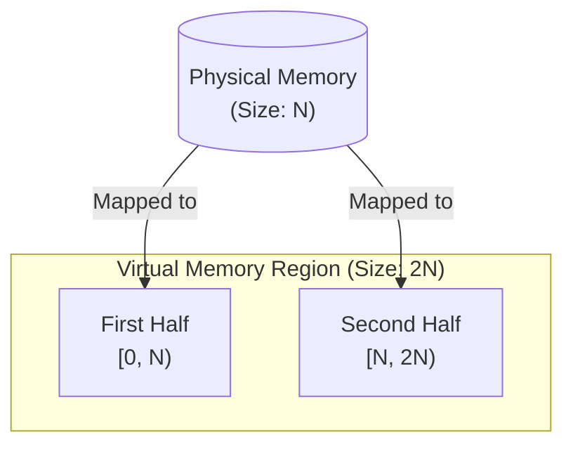

# SliceableRingBuffer

## The Meaning of "Sliceable"

In standard ring buffers (like `std::collections::VecDeque`), when the stored data "wraps around" the boundary of its internal array (e.g., part is at the end of the array and part is at the beginning), you cannot **directly** obtain a single contiguous slice. You must call `as_slices()`, which returns two separate slices, or call `make_contiguous()`, which returns a single contiguous slice.

## Implementation Principle: Virtual Memory Mirroring

This "magic" is achieved through a technique known as Virtual Memory Mirroring. We leverage the operating system's Memory Management Unit (MMU) to create a clever memory layout.
The process is as follows:

1. Allocate Virtual Address Space: We request a virtual memory address space of size `2 * N` from the operating system, but do not allocate any physical memory to it yet.
2. Allocate Physical Memory: We create an anonymous shared memory region (physical memory) of size N.
3. Perform Mapping: We request the operating system to map this physical memory block of size N to both the first half `[0, N)` and the second half `[N, 2N)` of the previously allocated virtual address space.
This creates a remarkable effect: data written to virtual address `addr` simultaneously "mirrors" and appears at the location `addr + N`.

## Differences from `std::collections::VecDeque`

`SliceableRingBuffer` is a specialized data structure that makes different trade-offs in memory allocation strategy compared to `VecDeque`, aiming for ultimate read and slice performance.

| Feature / Operation | `SliceableRingBuffer` | `std::collections::VecDeque` |
| :--- | :--- | :--- |
| **Obtain Contiguous Slice (`as_slice`)** | **O(1)**, always succeeds and is virtually zero-cost. | O(1) best case, **O(n) worst case** (when data wraps, may require allocating new memory and performing copies to provide a single slice). |
| **Iteration Performance** | **Faster**. Guaranteed memory continuity allows the CPU's cache and prefetch mechanisms to work more efficiently. | Fast. But when data wraps, iterators internally handle branch logic, incurring a slight performance overhead. |
| **Memory Allocation Method** | Uses **system calls** (`mmap`, `VirtualAlloc2`, etc.) to create virtual memory mappings. | Uses Rust's **global heap allocator** (`malloc`/`realloc`). |
| **Resize Cost (triggered by `push_back`)** | **Higher**. Re-establishing virtual memory mappings involves multiple system calls, which is costly. | **Lower**. Typically just one `realloc` call. |

**Summary**:

- If your core scenario is "**write once, read many times**" and requires frequently passing the entire buffer as a **contiguous slice** to other APIs, `SliceableRingBuffer` is an unparalleled choice.
- If your scenario involves frequent, fine-grained `push` and `pop` operations and rarely requires a contiguous view of the entire buffer, then `VecDeque` might be the more balanced choice.

## Why Capacity is Always Virtually Larger

This is because it's necessary to calculate the Least Common Multiple (LCM) of `T`'s size and the memory allocation granularity to ensure correct wrapping when the buffer is full. Different platforms have different memory allocation granularities. You can check the memory allocation implementations for various platforms under the `mirrored` module to learn more.

## Host Environment Requirements

The underlying virtual memory operations rely on specific operating system APIs, thus have minimum version requirements:

- **Windows**: Requires **Windows 10, version 1803 (April 2018 Update)** or later, and **Windows Server 2019** or later. (Depends on `VirtualAlloc2` and `MapViewOfFile3` APIs)
- **Linux**: Requires **Linux kernel version 3.17** or later. (Depends on the `memfd_create` system call)
- **macOS**: Supports all modern, supported macOS versions. (Depends on Mach VM API `mach_vm_remap`)
- **Other Unix (e.g., FreeBSD)**: Broadly supported. (Depends on the POSIX standard `shm_open` API)

## Features

You can add integration capabilities with key libraries in the ecosystem to `SliceableRingBuffer` by enabling feature flags:

- **`bytes`**:
  - **Effect**: Implements the `bytes::Buf` and `bytes::BufMut` traits.
  - **Use Case**: In high-performance network programming (e.g., using `tokio`, `hyper`, `tonic`), `bytes` is the de facto standard. This feature allows `SliceableRingBuffer` to be used directly as a network send/receive buffer without any data copying.

- **`serde`**:
  - **Effect**: Implements the `serde::Serialize` and `serde::Deserialize` traits.
  - **Use Case**: When you need to persist buffer contents to storage or transmit them over the network in a specific format (like JSON, Bincode, MessagePack), this feature allows easy serialization and deserialization.

- **`io`**:
  - **Effect**: Implements the standard library's `std::io::Read` and `std::io::Write` traits.
  - **Use Case**: For interacting with synchronous I/O APIs in the standard library, such as reading data from a file into the buffer or writing buffer data to a file.

- **`tokio-io`**:
  - **Effect**: Implements `tokio`'s `tokio::io::AsyncRead` and `tokio::io::AsyncWrite` traits.
  - **Use Case**: For I/O operations within the `tokio` asynchronous ecosystem. You can use `SliceableRingBuffer` directly in `tokio::io::copy` or other asynchronous I/O functions.

- **`unstable`** (Nightly only):
  - **Effect**: Enables a set of performance and memory optimizations based on the Rust Nightly toolchain.
  - **Use Case**: Suitable for projects pursuing ultimate performance and the latest features. Enabling this feature requires using the Nightly version of the Rust compiler. It utilizes the following Nightly APIs:
    - Advanced slice operations for `MaybeUninit` (`maybe_uninit_slice`).
    - Stricter integer overflow checks (calculations related to `strict_provenance`).
    - Leverages `NonZeroUsize` for niche optimization (`temporary_niche_types`) to optimize the memory layout of internal size fields.

## Relationship with [`slice_ring_buffer`](https://github.com/LiquidityC/slice_ring_buffer.git) and [`slice_deque`](https://github.com/gnzlbg/slice_deque)

`slice_ring_buffer` is a passively maintained fork of `slice_deque`. This project is an actively maintained fork of `slice_ring_buffer`. The author has reimplemented race-condition-free mirrored memory allocation for various platforms and redesigned the API. Since the entire project is almost completely rewritten, the tests have also been rewritten from scratch.

## "Sliceable" 的含义

在标准的环形缓冲区（如 `std::collections::VecDeque`）中，当存储的数据“环绕”了其内部数组的边界时（例如，一部分在数组末尾，一部分在数组开头），你无法**直接**得到一个单一的连续切片。你必须调用 `as_slices()`，它会返回两个独立的切片，或者调用 `make_contiguous()`，它会返回一个连续的切片。

## 实现原理：虚拟内存镜像

这种“魔法”是通过一种被称为虚拟内存镜像 (Mirrored Memory) 的技术实现的。我们利用操作系统的内存管理单元（MMU）来创建一个巧妙的内存布局。
过程如下：
申请虚拟地址空间: 我们向操作系统申请一段 `2 * N` 大小的虚拟内存地址空间，但暂时不分配任何物理内存给它。
分配物理内存: 我们创建一个 N 大小的匿名共享内存区域（物理内存）。
执行映射: 我们请求操作系统将这块大小为 N 的物理内存，同时映射到我们之前申请的虚拟地址空间的前半部分 `[0, N)` 和后半部分 `[N, 2N)`。
这会产生一个奇妙的效果：写入虚拟地址 `addr` 的数据，会“镜像”般地同时出现在 `addr + N` 的位置。

## 与 `std::collections::VecDeque` 的区别

`SliceableRingBuffer` 是一个特化数据结构，它为了极致的读取和切片性能，在内存分配策略上做出了与 `VecDeque` 不同的权衡。

| 特性 / 操作 | `SliceRingBuffer` | `std::collections::VecDeque` |
| :--- | :--- | :--- |
| **获取连续切片 (`as_slice`)** | **O(1)**，永远成功且几乎零成本。 | O(1) 最佳情况, **O(n) 最差情况** (当数据环绕时，需要分配新内存并执行拷贝才能提供单个切片)。 |
| **迭代性能** | **更快**。由于内存保证连续，CPU 的缓存和预取机制能更高效地工作。 | 较快。但在数据环绕时，迭代器内部需要处理分支逻辑，有轻微性能开销。 |
| **内存分配方式** | 使用**系统调用** (`mmap`, `VirtualAlloc2` 等) 来创建虚拟内存映射。 | 使用 Rust 的**全局堆分配器** (`malloc`/`realloc`)。 |
| **扩容成本 (`push_back` 触发)** | **较高**。重新进行虚拟内存映射涉及多次系统调用，开销较大。 | **较低**。通常只是一次 `realloc` 调用。 |

**总结**:

- 如果你的核心场景是“**写一次，读多次**”，需要频繁地将整个缓冲区作为**连续切片**传递给其他 API，`SliceRingBuffer` 是无与伦比的选择。
- 如果你的场景是频繁的、细碎的 `push` 和 `pop` 操作，且很少需要整个缓冲区的连续视图，那么 `VecDeque` 可能是更均衡的选择。

## 为什么容量始终虚大

因为需要计算 T 和 内存分配粒度的 LCM，才能在缓冲区饱满的时候确保环绕正确。不同的平台的内存分配粒度不同，你可以查看 `mirrored` 模块下各个平台的内存分配实现了解更多。

## 主机环境要求

底层的虚拟内存操作依赖于特定的操作系统 API，因此有最低版本要求：

- **Windows**: 需要 **Windows 10, version 1803 (2018年4月更新)** 或更高版本，以及 **Windows Server 2019** 或更高版本。 (依赖 `VirtualAlloc2` 和 `MapViewOfFile3` API)
- **Linux**: 需要 **Linux 内核版本 3.17** 或更高版本。 (依赖 `memfd_create` 系统调用)
- **macOS**: 支持所有现代、受支持的 macOS 版本。 (依赖 Mach VM API `mach_vm_remap`)
- **其他 Unix (如 FreeBSD)**: 广泛支持。 (依赖 POSIX 标准的 `shm_open` API)

## 特性

你可以通过启用 feature flags 来为 `SliceRingBuffer` 添加与生态系统中关键库的集成能力：

- **`bytes`**:
  - **作用**: 实现 `bytes::Buf` 和 `bytes::BufMut` 特性。
  - **场景**: 在高性能网络编程中（例如使用 `tokio`, `hyper`, `tonic`），`bytes` 是事实上的标准。此特性使得 `SliceRingBuffer` 可以直接作为网络收发缓冲区使用，无需任何数据拷贝。

- **`serde`**:
  - **作用**: 实现 `serde::Serialize` 和 `serde::Deserialize` 特性。
  - **场景**: 当你需要将缓冲区内容持久化存储，或通过网络以特定格式（如 JSON, Bincode, MessagePack）传输时，此特性可以让你轻松完成序列化和反序列化。

- **`io`**:
  - **作用**: 实现标准库的 `std::io::Read` 和 `std::io::Write` 特性。
  - **场景**: 用于与标准库中的同步 I/O API 交互，例如从文件读取数据到缓冲区，或将缓冲区数据写入文件。

- **`tokio-io`**:
  - **作用**: 实现 `tokio` 的 `tokio::io::AsyncRead` 和 `tokio::io::AsyncWrite` 特性。
  - **场景**: 在 `tokio` 异步生态中进行 I/O 操作。你可以直接在 `tokio::io::copy` 或其他异步 I/O 函数中使用 `SliceRingBuffer`。

- **`unstable`** (Nightly only):
  - **作用**: 启用一系列基于 Rust Nightly 工具链的性能和内存优化。
  - **场景**: 适用于追求极致性能和最新特性的项目。启用此特性需要使用 Nightly 版本的 Rust 编译器。它会利用以下 Nightly API：

    - MaybeUninit 的高级切片操作 (maybe_uninit_slice)。
    - 更严格的整数溢出检查 (strict_provenance相关的计算)。
    - 利用 NonZeroUsize 的 niche-optimization (temporary_niche_types) 来优化内部 size 字段的内存布局。

## 与 [`slice_ring_buffer`](https://github.com/LiquidityC/slice_ring_buffer.git) 和 [`slice_deque`](https://github.com/gnzlbg/slice_deque) 的关系

`slice_ring_buffer` 是 `slice_deque` 的被动维护分支，本项目是 `slice_ring_buffer` 的主动维护分支，本人重新实现了各个平台的无竞争镜像内存分配，以及重新设计了 API，由于整个项目几乎重写，测试也是重新编写的。
